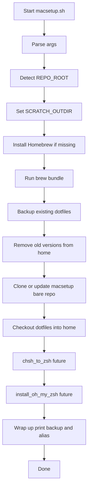
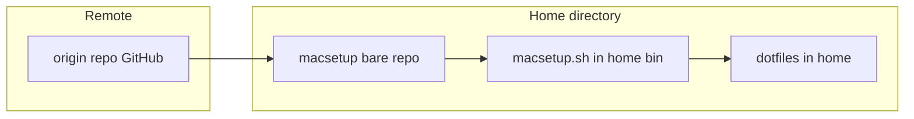

# macsetup

My Mac configuration files and setup script for quickly bootstrapping a new MacBook (Intel or Apple Silicon).

> **Note:** This README contains Mermaid diagrams. To preview them locally:
> - In **VS Code**, install the extension `bierner.markdown-mermaid` (via Homebrew Bundle: `vscode "bierner.markdown-mermaid"`).
> - Or use the **Mermaid Live Editor**: https://mermaid-js.github.io/mermaid-live-editor/

---

## Bootstrap (3 steps)

```bash
# Step 1: Clone the bare repo
git clone --bare git@github.com:randie/macsetup.git $HOME/macsetup-bare

# Step 2: Check out macsetup.sh from the bare repo into ~/bin
git --git-dir=$HOME/macsetup-bare --work-tree=$HOME checkout main -- bin/macsetup.sh

# Step 3: Run it
$HOME/bin/macsetup.sh
```

> Replace `main` with your actual default branch if different.  
> From here, `macsetup.sh` creates its own scratch directory, backs up existing files, checks out dotfiles, and handles the rest.

---

## Files Managed by `macsetup`

The following files from this repo will override what’s already on your Mac when you run `macsetup.sh`. Don’t worry — before anything is replaced, the script automatically creates a backup tarball so you can restore your previous versions if needed.

| Category            | Path / File                                   | Description                         |
|---------------------|-----------------------------------------------|-------------------------------------|
| **Dotfiles**        | `.Brewfile`                                   | Homebrew package/cask list          |
|                     | `.condarc`                                    | Conda configuration                 |
|                     | `.gitignore`                                  | Global gitignore                    |
|                     | `.p10k.zsh`                                   | Powerlevel10k prompt config         |
|                     | `.vimrc`                                      | Vim configuration                   |
|                     | `.zshrc`                                      | Zsh configuration                   |
|                     | `README.md`                                   | This file                           |
| **App Config**      | `.config/gh/config.yml`                       | GitHub CLI configuration            |
|                     | `.config/iterm2/com.googlecode.iterm2.plist`  | iTerm2 preferences                  |
| **Scripts**         | `bin/cleanpath`                               | Path cleaner                        |
|                     | `bin/cpdir`                                   | Directory copy helper               |
|                     | `bin/diff-from-base`                          | Git diff helper                     |
|                     | `bin/docker_cleanup.sh`                       | Docker cleanup utility              |
|                     | `bin/docker_list_images`                      | Docker image lister                 |
|                     | `bin/enkrypt`                                 | Encryption helper                   |
|                     | `bin/git-rename-remote-branch.sh`             | Git branch renamer                  |
|                     | `bin/grepl`                                   | Grep wrapper                        |
|                     | `bin/hardpath`                                | Path resolver                       |
|                     | `bin/killp`                                   | Kill process helper                 |
|                     | `bin/my-functions/dec`                        | Decryption helper                   |
|                     | `bin/my-functions/enc`                        | Encryption helper                   |
|                     | `bin/macsetup.sh`                             | Main bootstrap script               |
|                     | `bin/pr-for-commit`                           | PR helper                           |
|                     | `bin/save`                                    | File saver                          |
|                     | `bin/symdiff`                                 | Diff helper                         |
| **Editor Settings** | `save/vscode-settings.json`                   | VSCode settings                     |

---

## What `macsetup.sh` Does

The `bin/macsetup.sh` script automates the main steps required to setup a new MacBook with my configuration.

### Flow Overview (Diagram)



**Legend (optional):**
- **Run brew bundle** – installs from `.Brewfile`.
- **Backup existing dotfiles** – creates backup tarball.
- **macsetup bare repo** – `~/macsetup-bare`.
- **Checkout dotfiles into home** – applies repo-managed files.

---

### Where Files End Up (Diagram + Examples)

After a typical run:

```text
$HOME/
├─ macsetup-bare/                    # bare git repo (no working tree)
│  ├─ HEAD, objects/, refs/, ...     # internal git structures
│  └─ (used via --git-dir=... --work-tree=$HOME)
├─ bin/macsetup.sh                   # checked out bootstrap script
├─ .zshrc                            # checked out from repo
├─ .p10k.zsh                         # checked out from repo (if present)
├─ .gitconfig                        # checked out from repo
├─ .Brewfile or other dotfiles       # checked out from repo
└─ ... (other tracked files from the repo)
```

#### Mermaid: Paths Summary (bare-first)



**Legend:**
- **origin repo (GitHub)** – authoritative source.
- **macsetup bare repo** – `~/macsetup-bare` (bare clone).
- **macsetup.sh in ~/bin** – checked out from the **bare repo** using `--work-tree=$HOME`.
- **dotfiles in home** – applied by `macsetup.sh` after creating backups.

---

## Example Session

```bash
# Fresh setup
git clone --bare git@github.com:randie/macsetup.git $HOME/macsetup-bare
git --git-dir=$HOME/macsetup-bare --work-tree=$HOME checkout -f main -- bin/macsetup.sh
$HOME/bin/macsetup.sh -v

# Sample output (verbose)
[verbose] script path        : $HOME/bin/macsetup.sh
[verbose] REPO_ROOT          : $HOME
[verbose] SCRATCH_OUTDIR     : /tmp/macsetup-scratch
[verbose] brew available at  : /opt/homebrew/bin/brew
[verbose] Using Brewfile: $HOME/.Brewfile
[verbose] Created backup: /tmp/macsetup-backup-2508251530.tar
[verbose] Checked out dotfiles to $HOME

Done!

Backups (if any) were written to:
    /tmp/macsetup-backup-2508251530.tar

Make sure the following alias is in your .zshrc file:
    alias c='git --no-pager --git-dir=$HOME/macsetup-bare --work-tree=$HOME'
    Usage example: c status -s
```

---

## Troubleshooting

### 1. `brew: command not found` after running the script
- Ensure `/opt/homebrew/bin` (Apple Silicon) or `/usr/local/bin` (Intel) is in your `PATH`.  
- Run:
  ```bash
  eval "$(/opt/homebrew/bin/brew shellenv)"   # Apple Silicon
  eval "$(/usr/local/bin/brew shellenv)"      # Intel
  ```
- Then rerun the script.

### 2. `Permission denied (publickey)` when cloning
- Your GitHub SSH key isn’t set up.  
- Generate and add a key:
  ```bash
  ssh-keygen -t ed25519 -C "your_email@example.com"
  cat ~/.ssh/id_ed25519.pub
  ```
- Add the output to your GitHub account → Settings → SSH Keys.

### 3. Brewfile install fails (`brew bundle` errors)
- Ensure the Brewfile syntax is valid (`brew bundle check --file=.Brewfile`).  
- Comment out or remove lines for apps that are not supported on your Mac architecture.

### 4. Existing dotfiles not applied
- Check the backup tarball in `/tmp/macsetup-backup-<timestamp>.tar`.  
- Ensure you actually ran the 3 bootstrap steps correctly.  
- Rerun the script with `-v` to confirm checkout.

---

## Restoring from Backup

Whenever you run `macsetup.sh`, any files that will be replaced are first archived into a tarball, e.g.:

```
/tmp/macsetup-backup-2508251530.tar
```

### Restore Everything
```bash
tar -xf /tmp/macsetup-backup-2508251530.tar -C $HOME
```

### Restore One File
```bash
tar -xf /tmp/macsetup-backup-2508251530.tar -C $HOME .zshrc
```

### Restore a Subset of Files
```bash
tar -tf /tmp/macsetup-backup-2508251530.tar
tar -xf /tmp/macsetup-backup-2508251530.tar -C $HOME .zshrc .vimrc .p10k.zsh
```

Always review with `tar -tf` before extracting.

---

## Roadmap / TODO

- [ ] Implement `chsh_to_zsh` to switch login shell to brew-installed zsh.  
- [ ] Implement `install_oh_my_zsh` with idempotent installation.  
- [ ] Add `--dry-run` mode to preview actions without making changes.  
- [ ] Prune tracked files in repo to essentials only.  

---

## Summary

Running `macsetup.sh` on a new MacBook will:

1. Clone the bare repo.  
2. Check out `bin/macsetup.sh` into `~/bin`.  
3. Run `macsetup.sh`, which:  
   - Installs Homebrew (if missing).  
   - Installs packages and apps from Brewfile.  
   - Backs up existing dotfiles.  
   - Applies dotfiles via the bare repo.  
   - (Future) Switches login shell to brew-installed zsh.  
   - (Future) Installs Oh My Zsh.  
   - Prints wrap-up instructions.  

With this workflow, you can bootstrap a brand-new Mac in minutes, with confidence that everything is tracked and backed up.
